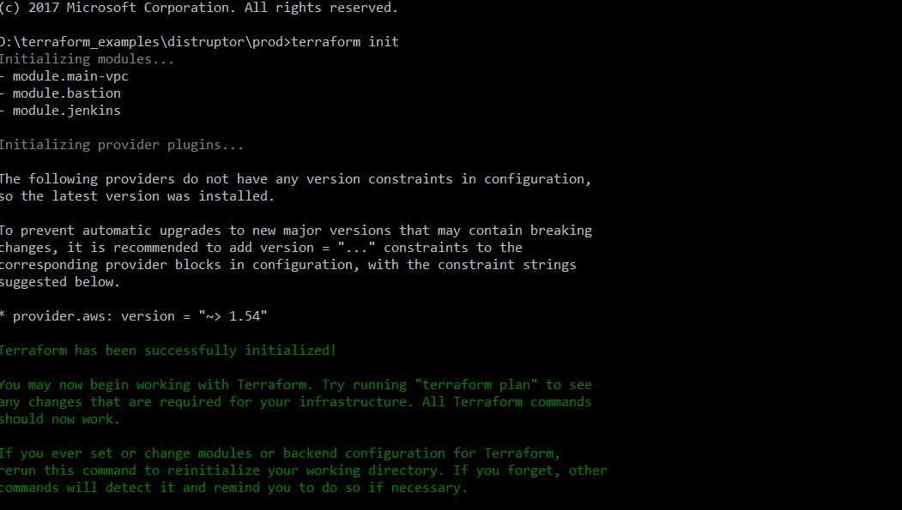

## InfraStructure Provisioning
Terraform is a tool for building, changing, and versioning infrastructure safely and efficiently. Terraform can manage existing and popular service providers as well as custom in-house solutions.

### Prerequisites
> AWS account (with programatic access)

>Terraform in your system

### Clone the repository
git clone https://github.com/karan6190/Infra-provisioning.git

### Commands to compile and run the IAC
**terraform init**
The terraform init command is used to initialize a working directory containing Terraform configuration files. This is the first command that should be run after writing a new Terraform configuration.
This command performs several different initialization steps in order to prepare a working directory for use.



**terraform plan**
The terraform plan command is used to create an execution plan. Terraform performs a refresh and then determines what actions are necessary to achieve the desired state specified in the configuration files.


**terraform apply**
The terraform apply command is used to apply the changes required to reach the desired state of the configuration


### Code Explanation
**modules**
```
autoscaling
bastion
beanstalk
ec2
iam
loadblancer
rds
vpc
```
1. **_Autoscaling_**
This module include AutoscalingGroup, Launchconfigurating and AutoscalingPolicy.


*Sample Template*
```
##This template creates the Autoscaling group and Launch configuration 
##with min size of 1 instances and max size of 2 Instance.
##

###Autoscaling
module "asg" {
  source                              = "../modules/autoscaling/"
  ENV                                 = "dev"
  AWS_REGION                          = "${var.AWS_REGION}"
  VPC_NAME                            = "fusion"
  subnets_id                          = "${module.main-vpc.public_subnets-2}"
  instance_type                       = "t2.micro"  # default is t2.micro
  key_name                            = "ssh-rsa AAAAB3NzaC1yc2EAAAABJQAAAQEApTZ5aSRGFe23ZBSV8SNDCky8JxEDnMLGmq5qi1FGcBe1W4k8In+jmeLVvhQ+RqPKRS97DNihoJ1bT99jdtFKGUBNTCGk+SF9+xCszmx2UBRUrPJyKJsZlnN1E3V9KwkWIlsvpziMdgCCrmzw/aBn28fxeK7lIV04XmVTl1wHVMBqGo4ur8ueYj7lHNJtAu0AY6BUadcHLl42bcw1UtlTEFSYFy9pUHDzjsSVx2OFA0aqEUf8xbG1VmU3J4h3rI0Omufd9rcovu2fmL0yrk4ls8B7R+Ss9GVNR9hMe7Ec5/zTiQNdpqKmuLToqxV8jnd5zL26zv4MnfZZoD3nQ== rsa-key-karan"
  security_groups                     = "${module.EC2.default_ec2_sg}"
  load_balancers                      = "${module.loadblancer.loadbalancer_name}"
  min_size                            = "1"  # default is 1
  max_size                            = "2"  # default is 2
  higherthreshold                     = "70" # default is 70
  lowerthreshold                      = "30" # default is 30
}
```

2. **_bastion_**
This module includes Ec2 instance (in a public subnets) which will acts as a Jump server for Instances in private subnets.
bastion-policy (Instance profile) will be attached to the Instance with Administrative access and the Security Group will allow the access over SHH

*Sample Template*
```
module "bastion" {
  source           = "../modules/bastion"
  ENV              = "dev"
  AWS_REGION       = "${var.AWS_REGION}"
  VPC_NAME         = "fusion"  #productID
  vpc_id           = "${module.main-vpc.vpc_id}"  #productVPC
  public_subnets   = "${module.main-vpc.public_subnets-1}"
}
```

3. **_EC2 _**
This module include EC2 instance (can be in public or private subnets) with default EC2 Security group and default-ec2Policy with Administrative access

*Sample Template*
```
## Sample Template for standalone Ec2 instance
##

###Ec2 Instance
module "EC2" {
  source                              = "../modules/ec2/"
  ENV                                 = "dev"
  AWS_REGION                          = "${var.AWS_REGION}"
  VPC_NAME                            = "fusion"
  vpc_id                              = "${module.main-vpc.vpc_id}"
  number_of_instances                 = "2"  # default is 1
  subnet_id                           = "${module.main-vpc.private_subnets-2}"  # Launching ec2 in private subnets
  instance_type                       = "t2.micro"  # default t2.micro
  user_data                           = "${file("userdata.sh")}"
  instance_name                       = "Terraform"
  instance_root_volume_size           = "8"  # default is 8
  instance_root_volume_type           = "standard"  # default is standard
  instance_root_volume_provisioned_io = "0"
  pubkey                              = "ssh-rsa AAAAB3NzaC1yc2EAAAABJQAAAQEApTZ5aSRGFe23ZBSV8SNDCky8JxEDnMLGmq5qi1FGcBe1W4k8In+jmeLVvhQ+RqPDNihoJ1bT99jdtFKGUBNTCGk+SF9+xCszmx2UBRUrPJyKJsZlnN1E3V9KwkWIlsvpziMdeYj7lHNJtAu0AY6BUadcHLl42bcw1UtlTEFSYFy9pUHDzjsSVx2OFA0nntECaqEUf8xbG1VmU3J4h3rrcovu2fmL0yrk4ls8B7R+Ss9GVNR9hMe7Ec5/zTiQNdpqKmuLToqxV8jnd5zL26zv4MnfZZoD3nQ== rsa-key-karan"  

}
```

NOTE
> Please mention your publickey in pubkey variable otherwise you won't be able to SSH into your Instance

4. **_iam_**
This module include InstanceProfile, Role, Policy creating and PolicyAttachment.

5. **_loadblancer _**
This module include creation of classic loadblancer with default security group and includes listener for HTTP and HTTPS. module automatically set the HTTPS(443 port) for the described Instance Port.

*Sample Template*
```
##This template creates the classic loadblancer 
##with attached Ec2 instance
##Template by default creates the HTTPS listener and re-route the instance port to 443 port.  

###Clasic loadblancer
module "loadblancer" {
  source                              = "../modules/loadblancer/classicloadblancer"
  ENV                                 = "dev"  #default dev
  AWS_REGION                          = "${var.AWS_REGION}"  #default us-east-1
  VPC_NAME                            = "fusion"
  applicationName                     = "Terraform"
  vpc_id                              = "${module.main-vpc.vpc_id}"
  subnets                             = "${module.main-vpc.public_subnets-2}"  # Lb needs to be in public subnets
  instance_port   		                = "80"  #default 80
  instance_protocol                   = "http"  #default http
  health_check_url		                = "HTTP:80/"   #default "HTTP:80/"
  lb_port                             = "80"										#default 80
  sslcert                             = "arn:aws:acm:us-west-2:ACCOUNT_NO:certificate/xxxxxxxxxxxxxxxxxxxxx"  #for accessing over https
  instance_id                         = "${module.EC2.instance_id}"
  #GW  					                      = "${module.main-vpc.internetgateway}"  #Ensure the VPC has an Internet gateway
  
}
```

NOTE
> you have to mention your SSL ARN

6. **_RDS _** 
This module includes creation of RDS instance with default-RDS security Group and creating public and private subnets group.
RDS instance will be launched in private subnet with default backup rentension period of 7 days and storage of 20 GB

*Sample Template*
```
module "rds" {
  source                  = "../modules/rds"
  ENV                     = "dev"  #default is dev
  AWS_REGION              = "${var.AWS_REGION}"  #default is us-east-1
  VPC_NAME                = "fusion"
  vpc_id                  = "${module.main-vpc.vpc_id}"
  public_subnets-1        = "${module.main-vpc.public_subnets-1}"
  public_subnets-2        = "${module.main-vpc.public_subnets-2}"
  private_subnets-1       = "${module.main-vpc.private_subnets-1}"
  private_subnets-2       = "${module.main-vpc.private_subnets-2}"
  multi_az                = "false"  #default false
  backup_retention_period = 7  #default 7
  publicly_accessible     = false  #default false
  minor_version_upgrade   = true  #default true
  major_version_upgrade   = false  #default false
  storage                 = "20"  #default 20
  engine                  = "mysql"  #default mysql
  engine_version          = "5.7"  #default 5.7
  instance_type           = "db.t2.small"  #default db.t2.small
  rdsname				          = "tesedb"  #database identifier
  dbname                  = "testTerraform"
  dbusername              = "terraform"
  dbpassword              = "${var.dbpassword}"
  
}
```

7. **_VPC _**
This module include setting up complete infra with VPC creation, 2 public and 2 private subnets and attached InternetGateway and 2 NatGateways.

*Sample Template*
```
module "main-vpc" {
  source           = "../modules/vpc"
  ENV              = "${var.ENV}"	  #productEnv
  AWS_REGION       = "${var.AWS_REGION}"
  VPC_NAME         = "${var.VPC_NAME}"  #productID
  az1              = "${var.AWS_REGION}a"
  az2              = "${var.AWS_REGION}b"
}
```

## Architecture


This is what the infrastructure provisioning architecture looks like.

Currently placing the *terraform.tfstate* on the s3 bucket (Centrally located) is not automated.To automate you can include backend.tf


**backend.tf**

```
terraform {
  backend "s3" {
    bucket = "${var.VPC_NAME}-${var.ENV}-terraform-state"
    key    = "terraform.tfstate"
    region = "${var.AWS_REGION}"
  }
}

``` 


